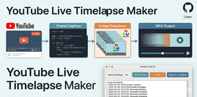

# ساخت تایم‌لپس از لایو یوتیوب

فارسی | **[English](README.md)**



یک برنامه دسکتاپ پایتونی که از یک لایو استریم یوتیوب در بازه‌های زمانی مشخص اسکرین‌شات می‌گیرد و در نهایت آن‌ها را تبدیل به یک ویدیوی تایم‌لپس می‌کند.

## نحوه کار

1. لینک مستقیم استریم را با استفاده از **yt-dlp** از لینک لایو یوتیوب استخراج می‌کند
2. با استفاده از **OpenCV** در بازه‌های زمانی دلخواه شما یک فریم از استریم می‌گیرد
3. هر فریم را به صورت یک فایل `.jpg` شماره‌گذاری شده در پوشه `screenshots/` ذخیره می‌کند
4. وقتی متوقف کنید، تمام فریم‌ها را به یک ویدیوی تایم‌لپس `.mp4` تبدیل می‌کند

اگر لینک استریم در طول یک جلسه ضبط طولانی منقضی شود، به صورت خودکار آن را بازیابی می‌کند.

## پیش‌نیازها

- Python 3.10+
- [yt-dlp](https://github.com/yt-dlp/yt-dlp)
- [OpenCV](https://pypi.org/project/opencv-python/)
- [Pillow](https://pypi.org/project/Pillow/)

## نصب

### ۱. نصب پایتون

پایتون نسخه 3.10 یا جدیدتر را از سایت رسمی دانلود و نصب کنید:

https://www.python.org/downloads/

> **کاربران ویندوز:** حتماً هنگام نصب گزینه **"Add Python to PATH"** را فعال کنید.

برای بررسی نصب، یک ترمینال باز کنید و دستور زیر را اجرا کنید:

```bash
python --version
```

### ۲. نصب وابستگی‌ها

```bash
pip install -r requirements.txt
```

## استفاده

برنامه را اجرا کنید:

```bash
python main.py
```

یک پنجره گرافیکی باز می‌شود که شامل موارد زیر است:

- **YouTube Live URL** — لینک لایو استریم یوتیوب را وارد کنید
- **Interval (seconds)** — فاصله زمانی بین هر اسکرین‌شات بر حسب ثانیه (پیش‌فرض: ۱۸۰ = ۳ دقیقه)
- **Start** — شروع گرفتن فریم‌ها
- **Stop & Build** — توقف ضبط و ساخت خودکار ویدیوی تایم‌لپس

ویدیوی خروجی با نام `timelapse.mp4` در پوشه پروژه ذخیره می‌شود.

همچنین نیازی نیست لایو یوتیوب را در مرورگر باز کنید :D فقط برنامه را باز نگه دارید و اتصال اینترنت داشته باشید. موفق باشید!

## تنظیمات

تنظیمات پیش‌فرض را می‌توانید در فایل `config.py` تغییر دهید:

| تنظیم | پیش‌فرض | توضیح |
|---------|---------|-------------|
| `YOUTUBE_URL` | — | لینک پیش‌فرض لایو استریم یوتیوب |
| `CAPTURE_INTERVAL` | `180` | فاصله بین هر فریم (ثانیه) |
| `SCREENSHOTS_DIR` | `screenshots` | پوشه ذخیره فریم‌ها |
| `TIMELAPSE_FPS` | `30` | نرخ فریم ویدیوی خروجی |
| `TIMELAPSE_OUTPUT` | `timelapse.mp4` | نام فایل ویدیوی خروجی |

## ساختار پروژه

```
youtube-live-timelaps-maker/
├── main.py          # نقطه شروع — اجرای رابط گرافیکی
├── capture.py       # منطق گرفتن فریم
├── timelapse.py     # ساخت ویدیوی تایم‌لپس
├── config.py        # تنظیمات پیش‌فرض
├── requirements.txt # وابستگی‌های پایتون
└── screenshots/     # فریم‌های ذخیره شده (خودکار ساخته می‌شود)
```
