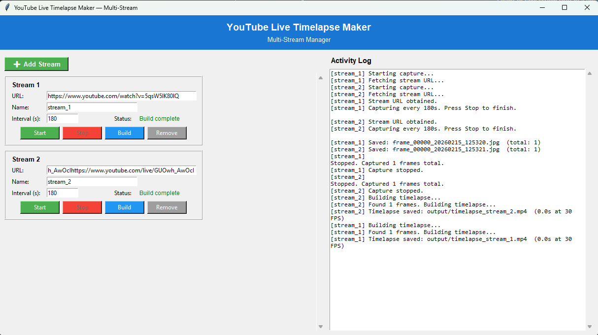

# ساخت تایم‌لپس از لایو یوتیوب

فارسی | **[English](README.md)**


یک برنامه دسکتاپ پایتونی که به صورت همزمان از چندین لایو استریم یوتیوب در بازه‌های زمانی مشخص اسکرین‌شات می‌گیرد و آن‌ها را به ویدیوهای تایم‌لپس تبدیل می‌کند. عالی برای مانیتورینگ چند استریم یا ساخت محتوای تایم‌لپس از پخش‌های زنده.

## امکانات

- **پشتیبانی از چند استریم** — ضبط همزمان از تعداد نامحدود لایو استریم یوتیوب
- **نام‌گذاری سفارشی** — نام‌گذاری هر استریم برای خروجی سازمان‌یافته
- **کنترل‌های مستقل** — شروع، توقف و ساخت جداگانه هر استریم
- **لاگ فعالیت زنده** — مانیتورینگ همه استریم‌ها به صورت لحظه‌ای
- **بازیابی خودکار URL** — مدیریت خودکار انقضای URL استریم
- **خروجی سازمان‌یافته** — پوشه‌های جداگانه برای اسکرین‌شات‌ها و ویدیوها

## نحوه کار

1. لینک مستقیم استریم را با استفاده از **yt-dlp** از لینک لایو یوتیوب استخراج می‌کند
2. با استفاده از **OpenCV** در بازه‌های زمانی دلخواه شما یک فریم از استریم می‌گیرد
3. هر فریم را به صورت یک فایل `.jpg` شماره‌گذاری شده در پوشه `screenshots/` ذخیره می‌کند
4. وقتی متوقف کنید، تمام فریم‌ها را به یک ویدیوی تایم‌لپس `.mp4` تبدیل می‌کند

اگر لینک استریم در طول یک جلسه ضبط طولانی منقضی شود، به صورت خودکار آن را بازیابی می‌کند.

## پیش‌نیازها

- Python 3.10+
- [yt-dlp](https://github.com/yt-dlp/yt-dlp)
- [OpenCV](https://pypi.org/project/opencv-python/)
- [Pillow](https://pypi.org/project/Pillow/)

## نصب

### ۱. نصب پایتون

پایتون نسخه 3.10 یا جدیدتر را از سایت رسمی دانلود و نصب کنید:

https://www.python.org/downloads/

> **کاربران ویندوز:** حتماً هنگام نصب گزینه **"Add Python to PATH"** را فعال کنید.

برای بررسی نصب، یک ترمینال باز کنید و دستور زیر را اجرا کنید:

```bash
python --version
```

### ۲. نصب وابستگی‌ها

```bash
pip install -r requirements.txt
```

## استفاده

برنامه را اجرا کنید:

```bash
python main.py
```

### رابط چند استریمی

برنامه با یک رابط دو پنلی باز می‌شود:

**پنل چپ (استریم‌ها):**
- روی **"➕ Add Stream"** کلیک کنید تا استریم جدید اضافه کنید
- هر استریم شامل:
  - **URL** — لینک لایو استریم یوتیوب
  - **Name** — نام سفارشی برای استریم (برای پوشه‌ها/فایل‌ها)
  - **Interval** — ثانیه بین اسکرین‌شات‌ها (پیش‌فرض: ۱۸۰)
  - **Status** — نمایشگر وضعیت لحظه‌ای
  - **Start/Stop** — کنترل‌های مستقل ضبط
  - **Build** — تبدیل فریم‌های ضبط شده به تایم‌لپس
  - **Remove** — حذف استریم از لیست

**پنل راست (لاگ فعالیت):**
- نمایش زنده عملیات همه استریم‌ها
- هر ورودی لاگ با نام استریم مشخص شده است

### ساختار خروجی

برای استریمی با نام `my_stream`:
- اسکرین‌شات‌ها: `screenshots/my_stream/`
- ویدیو: `output/timelapse_my_stream.mp4`

> **نکته:** نیازی نیست لایو یوتیوب را در مرورگر باز کنید. فقط برنامه را با اتصال اینترنت فعال نگه دارید.

## تنظیمات

تنظیمات پیش‌فرض را می‌توانید در فایل `config.py` تغییر دهید:

| تنظیم | پیش‌فرض | توضیح |
|---------|---------|-------------|
| `YOUTUBE_URL` | — | لینک پیش‌فرض لایو استریم یوتیوب |
| `CAPTURE_INTERVAL` | `180` | فاصله بین هر فریم (ثانیه) |
| `SCREENSHOTS_DIR` | `screenshots` | پوشه ذخیره فریم‌ها |
| `TIMELAPSE_FPS` | `30` | نرخ فریم ویدیوی خروجی |
| `TIMELAPSE_OUTPUT` | `timelapse.mp4` | نام فایل ویدیوی خروجی |

## تصاویر

### رابط اصلی

*مدیریت چند استریم با لاگ فعالیت*

## ساختار پروژه

```
youtube-live-timelaps-maker/
├── main.py          # نقطه شروع — اجرای رابط گرافیکی
├── capture.py       # منطق گرفتن فریم
├── timelapse.py     # ساخت ویدیوی تایم‌لپس
├── config.py        # تنظیمات پیش‌فرض
├── requirements.txt # وابستگی‌های پایتون
├── screenshots/     # فریم‌های ضبط شده (خودکار ساخته می‌شود)
│   ├── stream_1/    # فریم‌های استریم ۱
│   └── stream_2/    # فریم‌های استریم ۲
└── output/          # ویدیوهای تایم‌لپس (خودکار ساخته می‌شود)
    ├── timelapse_stream_1.mp4
    └── timelapse_stream_2.mp4
```
